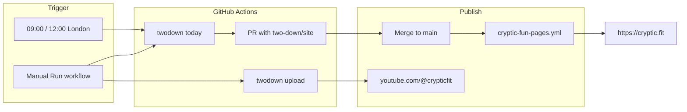

# cryptic.fit deployment prototype

Unattended daily pipeline: **GitHub Actions** cuts the pair, uploads to **@crypticfit**, and publishes **cryptic.fit** on GitHub Pages. No Cursor subscription required for the schedule.



## One-time setup

### 1. YouTube login (once)

On any machine with a browser (or paste the localhost URL into a Cloud Agent):

```bash
cd two-down
pip install -e .
mkdir -p ~/.config/twodown
# copy Google desktop client JSON to ~/.config/twodown/youtube-client-secret.json
twodown youtube-auth --start          # open URL, Continue, pick Cryptic Fit
twodown youtube-auth --finish 'http://localhost/?code=…'
```

### 2. GitHub repo secret

Repo **Settings → Secrets and variables → Actions → New repository secret**

| Name | Value |
|------|--------|
| `TWODOWN_YOUTUBE_TOKEN` | Full contents of `~/.config/twodown/youtube-token.json` |

Do not commit that file. The JSON must include `refresh_token`.

### 3. GitHub Pages

1. Repo **Settings → Pages → Build and deployment → Source: GitHub Actions**
2. Merge workflows: `.github/workflows/cryptic-fun-pages.yml` (site) and `.github/workflows/cryptic-fit-daily.yml` (daily job)
3. Custom domain **cryptic.fit** in Pages settings after DNS points at GitHub

### 4. DNS (Namecheap)

`A` records for `@` → GitHub Pages IPs (see `twodown live` or README).

## Daily behaviour

| Time | Workflow | What happens |
|------|----------|----------------|
| 08:00 & 11:00 UTC | `cryptic-fit-daily.yml` | `twodown today` → site + YouTube if token set → opens PR |
| On merge to `main` | `cryptic-fun-pages.yml` | Deploys `two-down/site/` to cryptic.fit |

## Manual runs (prototype testing)

**Actions → cryptic.fit daily → Run workflow**

| Input | Use |
|-------|-----|
| `slug` = `guardian-30108-27a` | Upload one Short already on the site |
| `skip_cut` = true | Upload only (today's pair in output/) |
| `youtube_privacy` = `unlisted` | Test without going public |

## Cursor vs GitHub Actions

| | Cursor Automation | This prototype |
|--|-------------------|----------------|
| Schedule | cursor.com/automations | GitHub cron (free) |
| Model | Claude (your pick) | No LLM — deterministic `twodown` CLI |
| Cost | Cloud Agent usage | GitHub Actions minutes |
| Best for | Iteration, fixes, PR polish | Production daily cut + upload |

Use **Claude in Cursor** when you need an agent to fix code. Use **GitHub Actions** when you want the same command every morning without a $200 IDE dependency.

## Checklist before go-live

- [ ] `TWODOWN_YOUTUBE_TOKEN` in GitHub Secrets (from tonight's login)
- [ ] Both workflows on `main`
- [ ] Pages source = GitHub Actions
- [ ] cryptic.fit DNS → GitHub Pages
- [ ] Manual workflow run with `slug` uploads a test Short
- [ ] Merge a daily PR; confirm https://cryptic.fit updates
